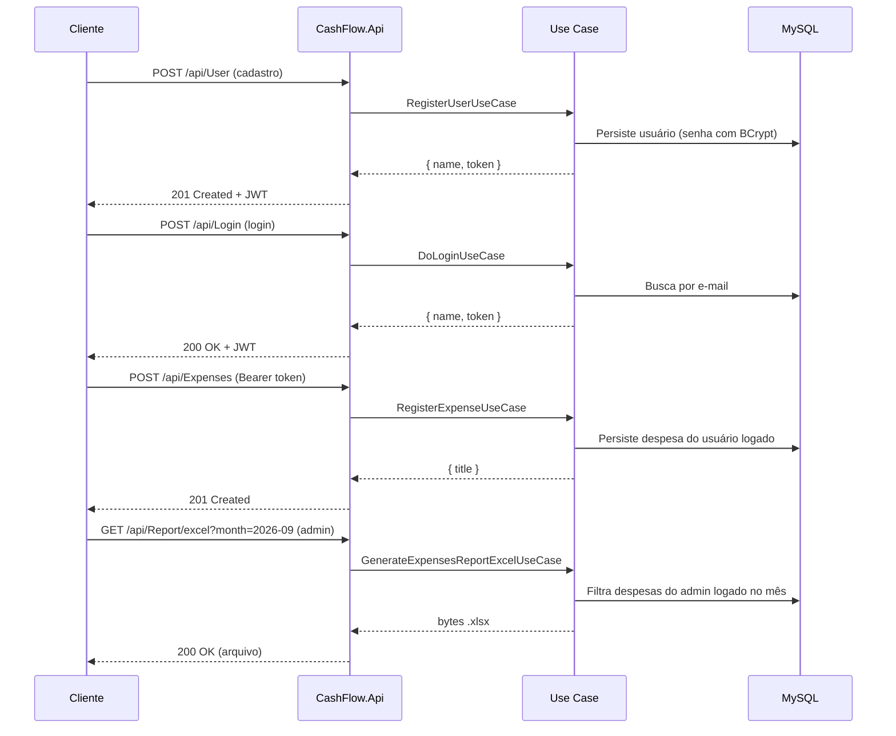

# CashFlowAPI

> [!IMPORTANT]
> Projeto de **aprendizado e prática**, baseado no conteúdo da Rocketseat. O objetivo é construir uma API completa aplicando **Domain-Driven Design (DDD)**, injeção de dependência, `async`/`await`, testes automatizados e boas práticas de backend em .NET.

API REST para **gestão de despesas pessoais**: cadastro de usuários, autenticação JWT, CRUD de despesas e geração de relatórios em Excel e PDF.

## Stack

| Tecnologia | Uso |
|---|---|
| .NET 8 | Runtime e SDK |
| ASP.NET Core | Web API |
| Entity Framework Core + Pomelo | Persistência (MySQL) |
| FluentValidation | Validação de entrada |
| AutoMapper | Mapeamento entre DTOs e entidades |
| BCrypt | Hash de senhas |
| JWT Bearer | Autenticação |
| ClosedXML / PDFsharp-MigraDoc | Relatórios Excel e PDF |
| Swashbuckle | Swagger/OpenAPI (ambiente Development) |
| xUnit | Testes |

## Arquitetura

O projeto segue **camadas DDD** com dependências apontando para o domínio:

```
┌─────────────────────────────────────────────────────────┐
│  CashFlow.Api          Controllers, Middleware, Filters │
├─────────────────────────────────────────────────────────┤
│  CashFlow.Application  Use Cases, Validators, AutoMapper│
├─────────────────────────────────────────────────────────┤
│  CashFlow.Domain       Entities, Enums, Repo Interfaces │
├─────────────────────────────────────────────────────────┤
│  CashFlow.Infrastructure  EF Core, Repos, JWT, BCrypt │
├─────────────────────────────────────────────────────────┤
│  CashFlow.Communication     Request/Response DTOs       │
│  CashFlow.Exception         Exceções e mensagens i18n   │
└─────────────────────────────────────────────────────────┘
```

### Responsabilidade de cada projeto

| Projeto | Responsabilidade |
|---|---|
| `CashFlow.Api` | Ponto de entrada HTTP. Controllers finos delegam para use cases. Middleware de cultura, filtro global de exceções, configuração JWT e Swagger. |
| `CashFlow.Application` | Casos de uso (`I*UseCase` + implementação), validadores FluentValidation e perfis AutoMapper. Sem dependência de infraestrutura. |
| `CashFlow.Domain` | Entidades (`User`, `Expense`), enums, contratos de repositório (`IExpenses*Repository`, `IUser*Repository`), `IUnitOfWork`, abstrações de segurança (`IPasswordEncripter`, `IAccessTokenGenerator`) e serviço `ILoggedUser`. |
| `CashFlow.Infrastructure` | Implementação de repositórios (EF Core), `CashFlowDbContext`, migrations, geração de JWT, BCrypt e resolução do usuário logado a partir do token. |
| `CashFlow.Communication` | DTOs de request e response expostos pela API. |
| `CashFlow.Exception` | Hierarquia `CashFlowException` e mensagens de erro localizadas (`.resx`). |

### Padrões aplicados

- **Use Case por operação** — cada endpoint injeta uma interface (`IRegisterExpenseUseCase`, etc.) resolvida via DI.
- **Repositórios segregados por operação** — `ReadOnly`, `WriteOnly` e `UpdateOnly` para leitura, escrita e atualização.
- **Unit of Work** — `Commit()` persiste transações após operações de escrita.
- **Validação na camada de aplicação** — FluentValidation antes de tocar o domínio ou persistência.
- **Exceções de domínio** — `CashFlowException` convertida em `ResponseErrorJson` pelo `ExceptionFilter`.

## Pré-requisitos

- [.NET 8 SDK](https://dotnet.microsoft.com/download/dotnet/8.0)
- [MySQL](https://www.mysql.com/) 8.x em execução local (ou acessível via rede), com o banco `CashFlow` já criado (as migrations aplicam o schema, mas não criam o database)

## Configuração

As credenciais **não estão no repositório**. Configure via **User Secrets** (recomendado) ou `appsettings.Development.json`.

### User Secrets

Na pasta do projeto da API:

```bash
cd src/CashFlow.Api

dotnet user-secrets set "ConnectionStrings:Connection" "Server=localhost;Port=3306;Database=CashFlow;User=SEU_USUARIO;Password=SUA_SENHA;"
dotnet user-secrets set "Settings:Jwt:SigningKey" "chave-secreta-com-pelo-menos-32-caracteres"
dotnet user-secrets set "Settings:Jwt:ExpiresMinutes" "1000"
```

| Chave | Descrição |
|---|---|
| `ConnectionStrings:Connection` | String de conexão MySQL usada pelo EF Core |
| `Settings:Jwt:SigningKey` | Chave simétrica HMAC-SHA256 para assinar tokens JWT |
| `Settings:Jwt:ExpiresMinutes` | Tempo de expiração do token em minutos (padrão no código de desenvolvimento: `1000`) |

> O `UserSecretsId` do projeto está em `src/CashFlow.Api/CashFlow.Api.csproj`.

### Migrations

Na primeira execução (fora do ambiente de teste), as migrations do EF Core são aplicadas automaticamente em `Program.cs`.

## Como rodar

```bash
# Na raiz do repositório
dotnet run --project src/CashFlow.Api
```

| Perfil | URL |
|---|---|
| HTTP | `http://localhost:5119` |
| HTTPS | `https://localhost:7164` |

Em **Development**, o Swagger está disponível em `/swagger` (o navegador abre automaticamente apenas ao usar um perfil de launch do Visual Studio ou `dotnet run` com `launchSettings.json`).

## Testes

```bash
dotnet test CashFlow.slnx
```

| Projeto de teste | Escopo |
|---|---|
| `tests/UseCases.Test` | Casos de uso (lógica de aplicação) |
| `tests/WebApi.Test` | Testes de integração da API |
| `tests/Validators.Tests` | Regras de validação |
| `tests/CommonTestUtilities` | Builders e utilitários compartilhados |

Os testes de integração usam banco em memória (`InMemoryTest: true` em `appsettings.Test.json`).

## Docker

```bash
docker build -t cashflow-api .
docker run -p 8080:8080 \
  -e ConnectionStrings__Connection="Server=host.docker.internal;Port=3306;Database=CashFlow;User=root;Password=senha;" \
  -e Settings__Jwt__SigningKey="chave-secreta-com-pelo-menos-32-caracteres" \
  -e Settings__Jwt__ExpiresMinutes="1000" \
  -e ASPNETCORE_URLS="http://+:8080" \
  cashflow-api
```

> O `Dockerfile` publica a API mas **não define variáveis de ambiente**. Sem `ConnectionStrings__Connection` e `Settings__Jwt__SigningKey`, a aplicação não sobe corretamente.

## Fluxo completo



### Passo a passo típico

1. **Cadastrar** — `POST /api/User` com nome, e-mail e senha. Retorna JWT.
2. **Autenticar** — `POST /api/Login` (alternativa ao cadastro). Retorna JWT.
3. **Usar a API** — enviar `Authorization: Bearer <token>` nos endpoints protegidos.
4. **Gerenciar despesas** — criar, listar, buscar por ID, atualizar e excluir.
5. **Relatórios** (somente administrador) — baixar Excel ou PDF com as **despesas do próprio usuário logado**, filtradas por mês.

## Autenticação

- Esquema: **JWT Bearer** (`Authorization: Bearer <token>`).
- Claims no token: `Name`, `Sid` (GUID do usuário) e `Role`.
- Novos usuários recebem a role padrão `teamMember`.
- Endpoints de **relatório** exigem role `administrator`.

### Promover usuário a administrador

Não há endpoint para alterar role. Para testar relatórios, atualize diretamente no MySQL:

```sql
UPDATE Users SET Role = 'administrator' WHERE Email = 'seu@email.com';
```

## Internacionalização

O `CultureMiddleware` lê o header `Accept-Language` e define a cultura da thread. Mensagens de erro vêm de arquivos `.resx` (pt-BR, pt-PT, fr, en). Cultura padrão: `en-US`.

## Contrato da API

Base URL: `/api`

### Formato de erro

```json
{
  "errorMessages": ["Mensagem de erro"]
}
```

| Exceção | HTTP |
|---|---|
| `ErrorOnValidationException` | 400 Bad Request |
| `InvalidLoginException` | 401 Unauthorized |
| `NotFoundException` | 404 Not Found |
| Erro desconhecido | 500 Internal Server Error |

---

### Login

#### `POST /api/Login`

Autentica usuário existente. **Não requer** token.

**Request**

```json
{
  "email": "usuario@email.com",
  "password": "Senha@123"
}
```

**Response `200 OK`**

```json
{
  "name": "João",
  "token": "eyJhbGciOiJIUzI1NiIs..."
}
```

**Response `401 Unauthorized`** — e-mail ou senha inválidos.

---

### Usuário

#### `POST /api/User`

Cadastra novo usuário. **Não requer** token. Retorna JWT.

**Request**

```json
{
  "name": "João Silva",
  "email": "joao@email.com",
  "password": "Senha@123"
}
```

**Validação de senha:** mínimo 8 caracteres, ao menos uma maiúscula, uma minúscula, um número e um caractere especial (`! ? * . @`).

**Response `201 Created`**

```json
{
  "name": "João Silva",
  "token": "eyJhbGciOiJIUzI1NiIs..."
}
```

**Response `400 Bad Request`** — validação ou e-mail já cadastrado.

#### `GET /api/User`

Retorna perfil do usuário logado. **Requer** token.

**Response `200 OK`**

```json
{
  "name": "João Silva",
  "email": "joao@email.com"
}
```

#### `PUT /api/User`

Atualiza nome e e-mail. **Requer** token.

**Request**

```json
{
  "name": "João Atualizado",
  "email": "novo@email.com"
}
```

**Response `204 No Content`**

#### `PUT /api/User/change-password`

Altera senha. **Requer** token.

**Request**

```json
{
  "password": "Senha@123",
  "newPassword": "NovaSenha@456"
}
```

**Response `204 No Content`**

#### `DELETE /api/User`

Remove conta do usuário logado. **Requer** token.

**Response `204 No Content`**

---

### Despesas

Todos os endpoints exigem **token** (`[Authorize]`).

#### `POST /api/Expenses`

**Request**

```json
{
  "title": "Supermercado",
  "description": "Compras do mês",
  "date": "2026-09-15T10:00:00Z",
  "amount": 250.50,
  "paymentType": 1,
  "tags": [0, 1]
}
```
**`paymentType` (enum)**

| Valor | Nome |
|---|---|
| `0` | Cash |
| `1` | CreditCard |
| `2` | DebitCard |
| `3` | EletronicTransfer |

**`tags` (enum)**

| Valor | Nome |
|---|---|
| `0` | Health |
| `1` | Essential |
| `2` | Variable |
| `3` | Fixed |
| `4` | Persnal |
| `5` | Emergency |
| `6` | Investment |
| `7` | Leisure |
| `8` | Education |
| `9` | Transportation |

**Validação:** título obrigatório; valor > 0; data não pode ser futura; `paymentType` e `tags` devem ser valores válidos do enum.

**Response `201 Created`**

```json
{
  "title": "Supermercado"
}
```

#### `GET /api/Expenses`

Lista despesas do usuário logado (resumo).

**Response `200 OK`**

```json
{
  "expenses": [
    { "id": 1, "title": "Supermercado", "amount": 250.50 }
  ]
}
```

**Response `204 No Content`** — sem despesas.

#### `GET /api/Expenses/{id}`

**Response `200 OK`**

```json
{
  "id": 1,
  "title": "Supermercado",
  "description": "Compras do mês",
  "date": "2026-09-15T10:00:00Z",
  "amount": 250.50,
  "paymentType": 1,
  "tags": [0, 1]
}
```

**Response `404 Not Found`** — despesa inexistente ou de outro usuário.

#### `PUT /api/Expenses/{id}`

Mesmo body do `POST`. **Response `204 No Content`**.

#### `DELETE /api/Expenses/{id}`

**Response `204 No Content`**

---

### Relatórios

Exigem token **e** role `administrator`. O relatório inclui apenas as despesas do **usuário autenticado** (não é um relatório global de todos os usuários).

#### `GET /api/Report/excel?month={date}`

#### `GET /api/Report/pdf?month={date}`

| Parâmetro | Tipo | Descrição |
|---|---|---|
| `month` | `DateOnly` (query) | Mês de referência (ex.: `2026-09` ou `2026-09-01`) |

**Response `200 OK`** — arquivo binário (`report.xlsx` ou `report.pdf`).

**Response `204 No Content`** — sem despesas no mês para o usuário logado.

**Response `403 Forbidden`** — token válido, mas usuário sem role `administrator`.

## Estrutura do repositório

```
CashFlowAPI/
├── CashFlow.slnx
├── Dockerfile
├── README.md
├── src/
│   ├── CashFlow.Api/
│   ├── CashFlow.Application/
│   ├── CashFlow.Communication/
│   ├── CashFlow.Domain/
│   ├── CashFlow.Exception/
│   └── CashFlow.Infrastructure/
└── tests/
    ├── CommonTestUtilities/
    ├── UseCases.Test/
    ├── Validators.Tests/
    └── WebApi.Test/
```

## Licença e créditos

Projeto educacional inspirado no conteúdo da [Rocketseat](https://www.rocketseat.com.br/).
